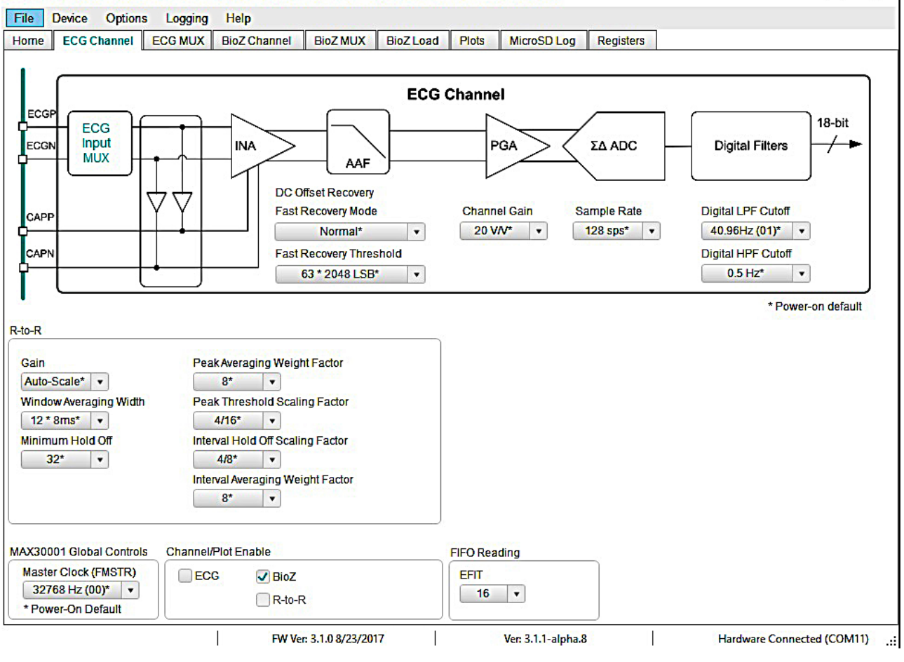
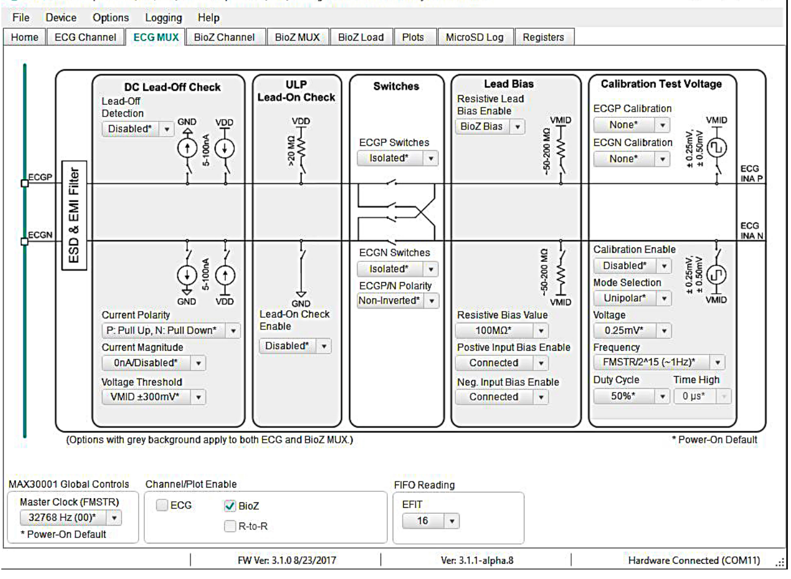
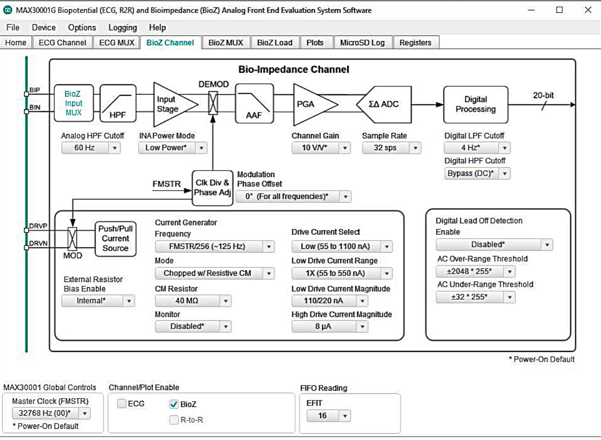
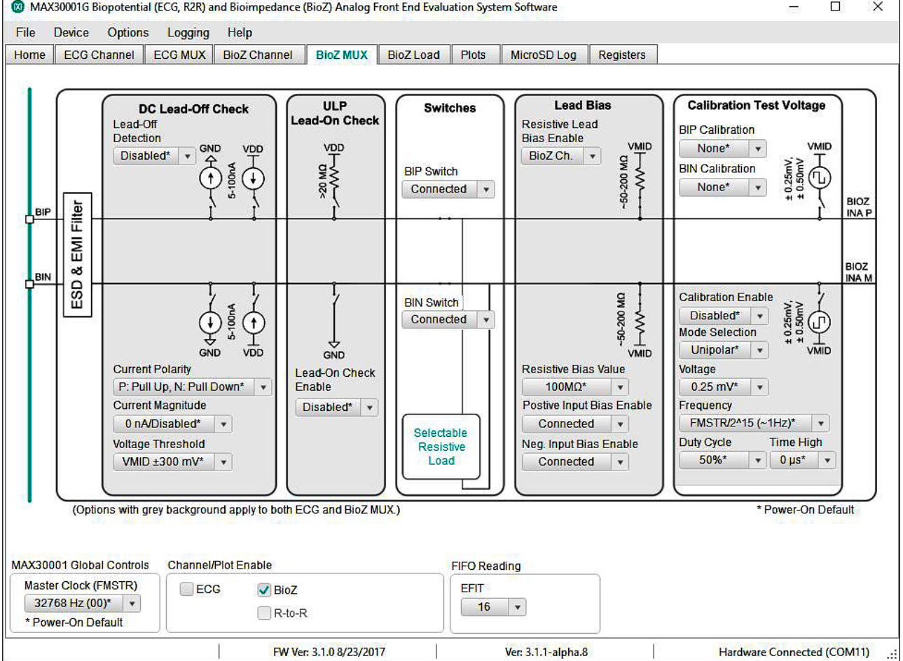
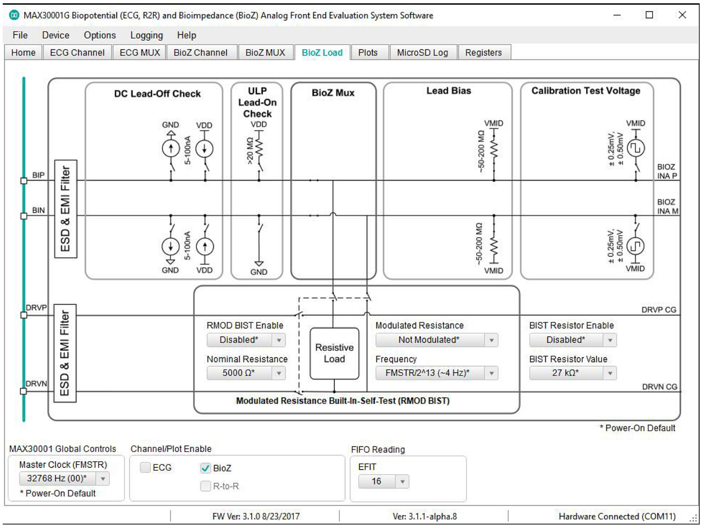
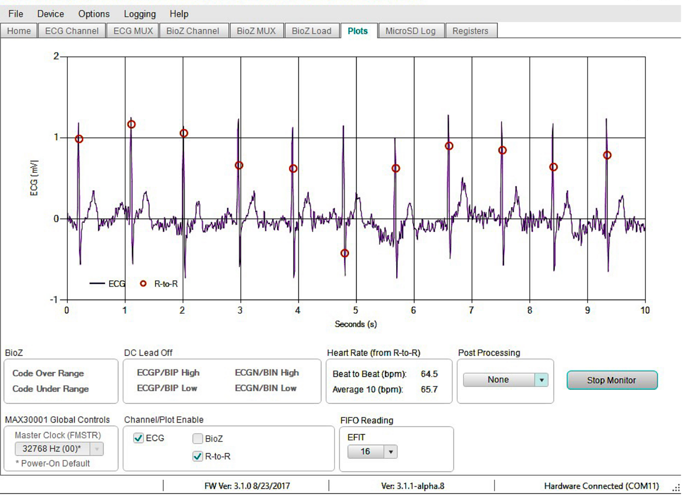

# The MAX30001 Evaluation Kit User Interface

## BOTH ECG and BIOZ Tab
  - Master Clock FMSTR
  - ECG  enable
  - BIOZ enable
  - RtoR enable

##  ECG Channel Tab

  - EFIT number of samples until interrupt
    - setFIFOInteruptThreshold(uint8_t  ECG, uint8_t  BIOZ)

  - ECG sampling rate
    - void MAX30001G::setECGSamplingRate(uint8_t  ECG)

  - ECG digital low pass and high pass filters
    - void MAX30001G::setECGfilter(uint8_t lpf, uint8_t hpf)
    - The allowable values will be applied
    - ECG_lpf and ECG_hpf have frequency

  - ECG channel gain
    - void MAX30001G::setECGgain(uint8_t gain)
    - Set the gain stage
    - ECG_gain global variable is updated  Application:

  - ECG offset recovery
      - setECGNormalRecovery
      - setECGAutoRecovery
      - startECGManualRecovery
      - stopECGManualRecovery
    - fast receiver normal 
    - fast recovery threshold

  - RtoR
    - Gain: Autoscale
    - Window averaging with: 12*8ms
    - Minimum hold off 32
    - Peak averaging weight factor 8
    - Peak threshold scaling factor 4/16
    - Interval hold off scaling factor 4/8
    - Interval averaging factor 8

## ECG MUX Tab

  - ECG Lead Off Detection
    - Enable/Disable
    - Polarity Pullup/down
    - Current magnitude nA
    - Voltage threshold: vmid +- 300mV

  - ECG ULP Lead On Detection
    - enable/disable

  - ECG Lead Polarity
    - Isolate
    - Inverted/NonInverted

  - ECG Lead Bias
    - BIOZ bias enable/disable
    - Bias resistance 100MOhm
    - Positive input bias enable
    - Negative input bias enable

  - ECG Calibration
    - ECGN
    - ECGP 
    - Enable/Disable
    - Unipolar/Bipolar
    - Voltage 0.25mV
    - Freqeuncy
    - Dutycyle or Time High

## BIOZ Channel Tab

  - BIOZ analog highpass and digital low and high pass filter
    - A HP 60Hz
    - LPF 4Hz
    - HPF Bypass

  - BIOZ INA power mode
    - low/high

  - BIOZ Phase Offset
    - 0-160 degrees

  - BIOZ gain
    - void MAX30001G::setBIOZgain(uint8_t gain)
    - 20V/V

  - BIOZ sample rate
    - void MAX30001G::setBIOZSamplingRate(uint8_t  BIOZ)
    - 32sps
 
  - BIOZ external bias resistor 
    - Internal / External

  - BIOZ modulation frequency
    - void MAX30001G::setBIOZmodulationfrequency(uint16_t frequency)    

  - BIOZ modulation mode
    - choppped with resistive CM

  - BIOZ CM Resistor
    - 40MOhm

  - BIOZ Current Monitor
    - Enable / Disable

  - BIOZ current
    - void MAX30001G::setBIOZmag(uint32_t current)
    - low 55-1100nA
    - low 1x or 2X 
    - low magnitude
    - high mangitude

    adjust BIOZ current feedback resistor depenDing on low or high current mode

  - BIOZ digital lead off
    - checks measurement values
    - enable/disable
    - AC over range threshold +/- 2048*255
    - AC under range threshold +/- 32*255

## BIOZ MUX Tab

  This is the same as ECG MUX for leadon/leadoff

  - BIOZ analog lead off
    - measures voltage
    - enable/disable
    - current polairyt pullup/down
    - currnt magnitude nA
    - votlage threshold VMID+/-300mV

  - BIOZ analog lead on
    - enable/disable

  - BIOZ connected
    - connected/isolated
    - resitive load
  
  - BIOZ lead bias
    - resitive bias value 100MOhm
    - positive/negative enable/dsiable

  - BIOZ calibration
    - BIP/BIN calibration mode enable/disable
    - enable/disable
    - mode unipolar
    - voltage 0.25mV
    - frequency fmstr/2^15
    - duty cycle or time high

## BIOZ Load Tab

  - BIOZ builitin resistance test
    - BIST enable/disable
    - resitance 5000 Ohm
    - modulate resistance on/off1
    - modutale resistance frequency

## Example Plot
| 

