# Section 1: Physics Background

**Electric Potential Difference:** In physics, an electric _potential difference_ (voltage) between two points is the amount of work needed to move a unit electric charge from one point to the other. Mathematically, it is defined as the change in potential energy per unit

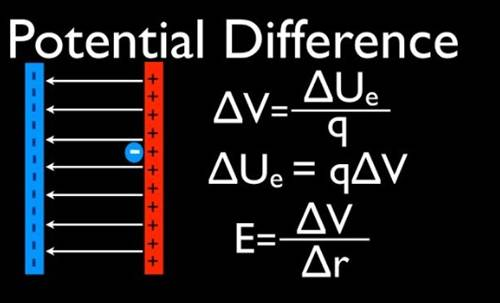

where Δ𝑈is the change in electric

potential energy and 𝑞is the charge. The unit of potential difference is the **volt (V)**, which equals one joule per coulomb. A classic example is a battery: it maintains a separation of charges between its two terminals, creating a voltage (for instance, a 9 V battery has a 9- volt potential difference between its positive and negative terminals). In essence, a potential difference exists whenever charges are unevenly distributed, causing one location to be more positively or negatively charged relative to another. This imbalance of charge sets up an electric field, and if a conductive path is provided, charges will tend to flow from the higher potential to the lower potential to equalize, creating an electric current.

**What Causes Potential Difference:** A potential difference can be caused by any mechanism that separates electric charge. In the human body, as we will see, cellular processes (like ion pumps and channels in cell membranes) separate ions across membranes, creating an electric potential. Fundamentally, _separation of charge_ is the root cause – whether by chemical, mechanical, or electrical means – of a voltage. Coulomb’s law describes how like charges repel and opposite charges attract; separating opposite charges (or accumulating like charges separately) requires work and creates stored electric potential energy.

**Detection of Voltage with Electrodes:** To _detect_ a potential difference, we use **_electrodes_**, which are conductive sensors placed at two points of interest. Any measuring device for voltage (a voltmeter, or in bioelectric contexts an ECG amplifier) essentially compares the electric potential at one electrode to the potential at another. The electrode pair picks up the **_voltage difference_** between those two locations. Importantly, voltage is always relative between two points – a single electrode on its own measures nothing without a reference. Thus, at least two electrodes are required to measure a bioelectric potential. The measured voltage is the potential difference between the electrodes. In the

context of the body, one electrode might serve as a reference (or ground) while another picks up the local potential; the difference between them indicates the electrical activity at that site relative to the reference. An electrode typically consists of a metal in contact with an electrolyte (gel or body fluids). It works by converting the ionic currents in the body into electronic currents in a wire. In other words, it transduces the local ionic charge difference into an electrical signal that our instruments can detect.

# Section 2-Bio/Physio background

1- Biochemistry What is the origin of bio potential? Start from the Basics Nucleus to cells to Tissues to Organs to System to Human

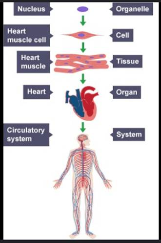

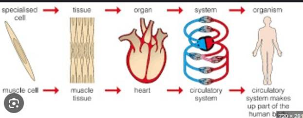

_Figure 2_ illustrates the hierarchy from cells to the organ systems.

**From Cells to Systems:** Bioelectric potentials originate at the cellular level and scale up to the whole organism. The human body is composed of trillions of cells (each cell containing a nucleus and surrounded by a plasma

membrane), which organize into tissues, organs, and organ systems. At every level, electrical phenomena are present. For instance, individual heart muscle cells generate electrical impulses, tissues (like cardiac muscle tissue) coordinate these impulses, the heart (an organ) synchronizes the activity of millions of cells, and the cardiovascular system as a whole depends on these electrical signals for rhythmic pumping.

https://www.youtube.com/watch?v=MplWXZTOk6o

# Introduction of Bio potential:

_Electrical potentials exist across the membranes of virtually all cells of the body._

**Cell Membrane Potential – The Source of Bioelectricity:** Nearly all living cells maintain an electrical potential difference across their cell membrane. This is known as the membrane potential. It arises from the unequal distribution of ions (charged particles) inside and outside the cell, and the selective permeability of the cell membrane to those ions. In a typical cell, sodium (Na⁺) and chloride (Cl⁻) ions are more concentrated in the extracellular fluid, whereas potassium (K⁺) and various negatively charged proteins are more concentrated inside the cell. A key contributor is the

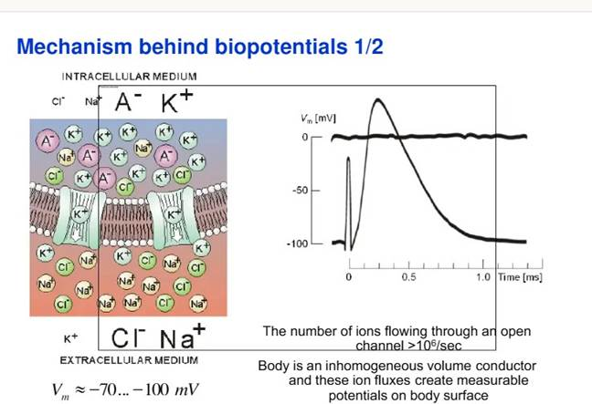

_Figure 3_ Action potential sequence

**sodium-potassium pump** (Na⁺/K⁺ ATPase), a membrane protein that actively transports Na⁺ out of and K⁺ into the cell, consuming energy (ATP) to maintain concentration gradients. For each cycle it moves 3 Na⁺ ions out and 2 K⁺ ions in, leaving a net deficit of positive charge inside, helping make the interior more negative relative to the outside.

To understand an action potential, consider a typical sequence (illustrated in _Figure 3_ ):

- **Depolarization:** If a cell is stimulated (for example, a pacemaker cell in the heart spontaneously depolarizes, or a nerve cell is excited by a neurotransmitter), the membrane potential can become less negative. Once it reaches a threshold, voltage-gated Na⁺ channels open. Sodium ions rush _into_ the cell (driven by both concentration and electrical gradients), bringing positive charge inside. This influx of Na⁺ causes the membrane potential to shoot up from around –70 mV toward positive values. In fact, the membrane potential may overshoot to around +30 mV (inside now positive relative to outside). This process is depolarization, and it happens very rapidly (on the order of a millisecond in nerve cells, a bit slower in cardiac muscle). The cell’s polarization is now reversed (inside positive).

- **Repolarization:** After a brief moment, the Na⁺ channels inactivate (close) and **K**⁺ **channels** open. Now potassium ions flow _out_ of the cell (since the inside is positive and K⁺ is high inside), carrying positive charge out and thus dropping the membrane potential back down. This returns the inside of the cell to a negative voltage, restoring the resting state. This phase is **repolarization**. In cardiac cells, there is also a plateau phase (due to Ca²⁺ influx) which prolongs the action potential, but eventually K⁺ efflux dominates to repolarize the cell. After repolarization, the original ion gradients are restored (Na⁺ pumped back out, K⁺ in) to prepare for the next excitation.
- **All-or-None Law:** An action potential is all-or-none – if threshold is reached, a full standard spike occurs; if threshold is not reached, nothing happens. The amplitude and shape of the action potential for a given cell type are generally fixed, regardless of stimulus strength (as long as it’s above threshold). There is also a refractory period after an action potential during which the cell cannot easily fire another one, ensuring unidirectional propagation in neurons and a limit to firing frequency.

In summary, the bioelectric potential of excitable cells goes through cycles of polarization (resting state, e.g. –70 mV), depolarization (active state, e.g. +30 mV), and repolarization (return to rest) during an action potential. These voltage changes on the cell membrane are the fundamental signals that coordinate functions in nerves and muscles. Groups of cells can be excited in waves, leading to propagated electrical signals across tissues.

# From Cells to Heartbeat – Electrical Activity of the Heart:

Now we zoom out to the organ level, particularly the heart, which is our focus for ECG sensing. The heart is a muscular pump divided into **four chambers** (two upper atria and two lower ventricles). Functionally, it is indeed two pumps working in parallel: the right heart pumps deoxygenated blood to the lungs (pulmonary circuit) and the left heart pumps oxygenated blood to the body (systemic circuit). To pump efficiently, the heart muscle (myocardium) must contract in a coordinated rhythm. This coordination is achieved by the heart’s intrinsic **electrical conduction system**.

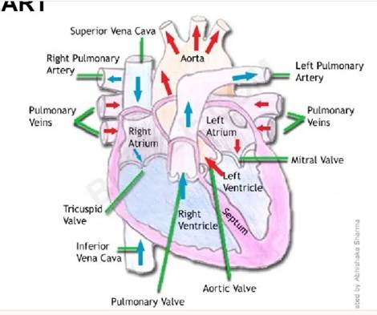

_Figure 4 Heart anatomy_

The heart generates its own rhythmic electrical impulses (it’s **myogenic**), thanks to

specialized pacemaker cells. The primary pacemaker is the **sinoatrial (SA) node**, a small

patch of specialized tissue in the right atrium. The SA node automatically generates an electrical impulse roughly 60–100 times per minute under normal conditions. Each impulse from the SA node initiates a heartbeat. From the SA node, the electrical wave spreads through the atria causing the atrial muscle to depolarize and contract, pushing blood into the ventricles. The impulse then reaches the **atrioventricular (AV) node**, another specialized cluster of cells located at the junction between atria and ventricles. The AV node serves as the only electrical bridge between the atria and ventricles (insulating tissue otherwise separates

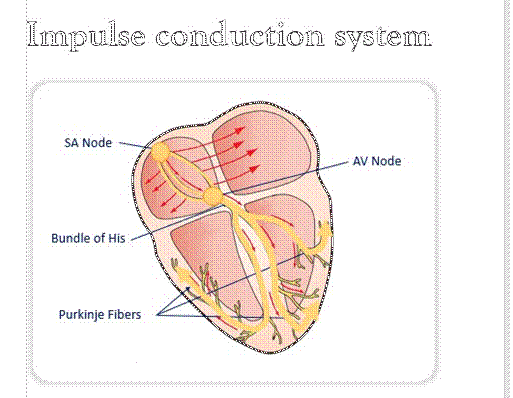

_Figure 5 Heart conduction system_

[https://www.youtube.com/watch?v=v7Ǫ9BrNf](https://www.youtube.com/watch?v=v7Q9BrNfIpQ) [IpǪ](https://www.youtube.com/watch?v=v7Q9BrNfIpQ)

[https://www.youtube.com/watch?v=RYZ4daF](https://www.youtube.com/watch?v=RYZ4daFwMa8) [wMa8](https://www.youtube.com/watch?v=RYZ4daFwMa8)

them) and it introduces a slight **delay** in the signal.

This delay (about 0.1 second) is crucial: it gives the ventricles time to fill with blood after the atria contract, before the ventricles themselves contract.

After the AV node, the impulse travels rapidly down the **Bundle of His** (a specialized conducting fiber tract) which splits into **right and left bundle branches** running along the interventricular septum. These branches further divide into an extensive network of **Purkinje fibers** that spread throughout the walls of the ventricles. The Purkinje network ensures the electrical signal is delivered quickly and nearly simultaneously to left and right ventricles, especially to the ventricular muscle cells from the inner wall outward.

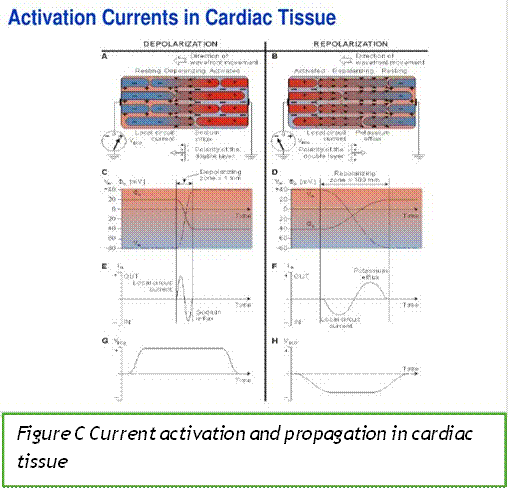

_Figure C Current activation and propagation in cardiac tissue_

As a result, the ventricles depolarize in a coordinated fashion and contract together, forcing blood out to the lungs and body.

To summarize this pathway in order: **SA node (pacemaker) → atrial pathways → AV node (delay) → Bundle of His → bundle branches (right/left) → Purkinje fibers → ventricular muscle.** _Figure 4 \[Fig 4\]_

schematically shows the heart’s chambers and the key nodes (SA and AV) and pathways in the conduction system, while _Figure 5 and Figure C \[Fig 5, Fig C\]_ illustrate how an electrical impulse originates at the SA node and propagates through the heart.

Heart Muscle and intercalated cells, gap Junctions and Prunjnkie fibers and the role of

each in conduction

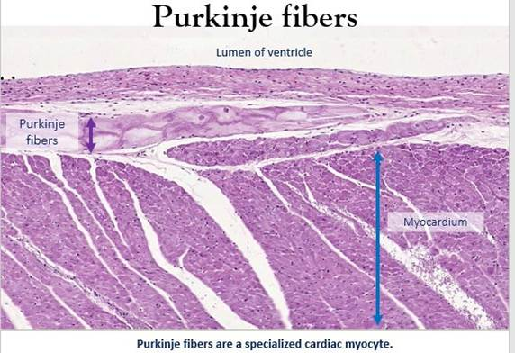

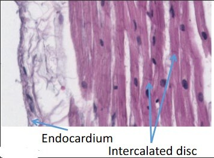

Fig 8 Fig 9

**Electrical Waveforms in the Heart:** As the cardiac cells depolarize and repolarize in sequence, the heart produces characteristic electrical waves. The progression is as follows:

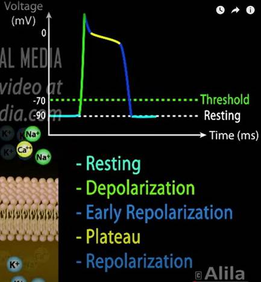

- The SA node fires, and the atria depolarize first. This atrial depolarization is seen as the P wave on an ECG tracing. After the atria contract and the impulse passes through the AV node, the ventricles depolarize. Ventricular depolarization is a large event (because the ventricular muscle mass is large) and appears as the ǪRS complex on the ECG. Finally, the ventricles repolarize to their resting state, which is seen as the T wave on the ECG. (Atrial repolarization also occurs, but it is small and gets obscured by the ǪRS complex on a normal ECG.)

Thus, polarization (resting state), depolarization (active contraction), and repolarization

(recovery) correspond to distinct waveform components.

# Section 3: ECG (Electrocardiogram) Principles

_Figure 11_ block diagram of an ECG setup

**From Heart Electrical Activity to Surface Signals:** Every heartbeat is initiated and coordinated by the electrical events described above. These electrical events create currents that flow through the body’s conductive fluids. The heart’s active tissues act somewhat like a voltage source inside a volume conductor (the body). As the heart depolarizes and repolarizes, it sets up time-varying potential differences throughout the body. By placing electrodes on the skin at various

locations, we can detect these changing potential differences. In simple terms, an electrocardiogram (ECG or EKG) is a recording of the heart’s electrical activity as measured at the body surface. The ECG does not directly measure the heart’s internal electrical signals at their source (since we’re measuring from the skin); rather, it measures the field generated by those signals. Essentially, it’s picking up the _changing voltage between pairs of electrodes_ caused by the heart’s electrical dipole as it moves through the cardiac cycle.

**What is an ECG?:** The ECG is a noninvasive, quick, and widely used clinical tool. It provides a graph (voltage over time) of the heart’s electrical cycle. Clinically, an ECG is used to assess heart rhythm and conduction, detect abnormalities in the heartbeat, and infer certain cardiac conditions. For example, it is often one of the first tests done to evaluate chest pain or suspected heart disease because it can reveal arrhythmias (irregular heart rhythms), signs of ischemia or infarction (reduced blood flow or heart attack), chamber enlargement, electrolyte imbalances, and more. It’s essentially the _gold standard_ for diagnosing many types of arrhythmias and conducting system disorders. A normal ECG has a characteristic pattern (P wave, ǪRS complex, T wave as discussed) that indicates normal synchronized depolarization and repolarization; deviations from normal shape, timing, or amplitude of these waves can indicate pathology.

**How ECG Measurement Works:** To record an ECG, electrodes are placed on the skin in specific standardized locations. Typically, a 12-lead ECG is the clinical standard. It uses 10 physical electrodes: 4 limb electrodes (one on each arm and leg, usually on the wrists and ankles) and 6 chest electrodes (placed at defined positions on the chest around the heart). These electrodes are used in combinations to create 12 leads, where each _lead_ is like a

viewpoint or angle from which we observe the heart’s electrical activity. Six leads are oriented in the frontal plane (the limb leads) and six in the horizontal plane (the chest, or precordial leads).

- - The **standard limb leads (I, II, III)** are _bipolar_ leads that measure the voltage difference between two limb electrodes: Lead I = left arm (LA) – right arm (RA); Lead II = left leg (LL) – right arm (RA); Lead III = left leg (LL) – left arm (LA). These leads form the classic Einthoven’s triangle around the heart. (For example, Lead I measures the potential difference between the left and right arms. We can write this as

𝑉𝐼 = 𝑉𝐿𝐴 − 𝑉𝑅𝐴.)

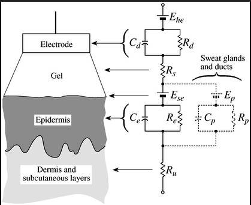

_Figure 12_

- - - The **augmented limb leads (aVR, aVL, aVF)** are _unipolar_ leads that use one limb electrode as the “exploring” electrode and combine the others as a reference (ground). They effectively look at the heart from the direction of the right arm (aVR), left arm (aVL), and left foot (aVF). Together with leads I–III, these six leads examine the heart’s electrical projections on the frontal (vertical) plane.

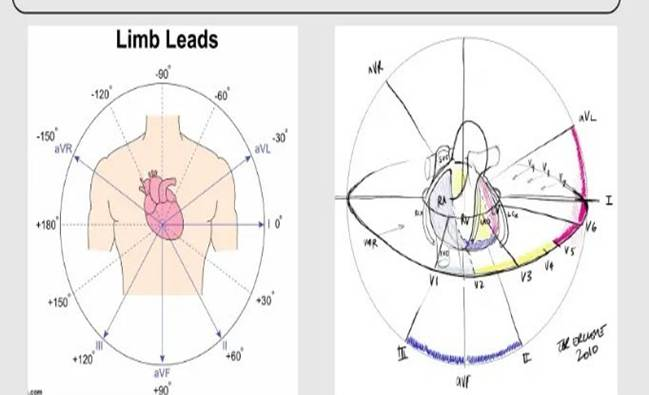

_Figure 13_ lead placements and configurations

- The **precordial (chest) leads (V1–V6)** are also unipolar leads, each placed at a specific intercostal space and position on the chest around the heart. They view the heart’s electrical activity in the horizontal plane, giving front-to-back perspectives. For instance, V1 and V2 are near the right ventricle, V5 and V6 near the left ventricle, etc.

Each lead “sees” the heart’s electrical dipole from a different angle, so the ECG tracings differ slightly in each lead, providing comprehensive information about the heart’s 3D electrical activity.

**ECG Signal Processing:** The voltage signals picked up by the electrodes are on the order of microvolts to a couple of millivolts (mV) at the skin surface. These signals are very small and are susceptible to noise. Therefore, the ECG machine contains an amplifier with high gain to boost the cardiac signals to a measurable level. It also uses a high input impedance so as not to disturb the body’s signals and a differential input to reject common-mode noise. One common noise is mains interference (50/60 Hz from electrical power lines), which couples into the body; a good ECG amplifier employs common-mode rejection to cancel out noise that is common to both electrodes. The ECG circuitry also includes filters to remove high-frequency noise and baseline wander (slow drift of the baseline due to respiration or movement). After amplification and filtering, the ECG outputs the cleaned waveform, either to a computer screen, paper chart, or memory for analysis. In summary, the steps are: **electrodes pick up the voltage → signals travel through wires to the ECG device → amplification and filtering occur → the ECG waveform is generated and displayed or recorded**.

**The ECG Waveform:** The recorded ECG waveform is a voltage vs. time graph. A normal heartbeat cycle in one lead typically includes: a **P wave** (atrial depolarization), a **ǪRS complex** (ventricular depolarization, with Ǫ and S as slight downward deflections before and after the tall R wave), and a **T wave** (ventricular repolarization). Sometimes a small U wave is seen after the T wave (thought to be repolarization of certain cells or Purkinje fibers). The timing and amplitude of these components are standardized: for example, the

P wave is small (0.1 second or less in duration), ǪRS is sharp and narrow (around 0.08–0.10 s in healthy hearts), and T wave is broader. The intervals between these, such as the PR interval (start of P to start of ǪRS, ~0.12–0.20 s) and the ǪT interval (start of ǪRS to end of T, ~0.35–0.44 s), are important indicators of electrical function and are carefully measured on an ECG. These values correspond to how long it takes the wave to travel through the AV node (PR interval)

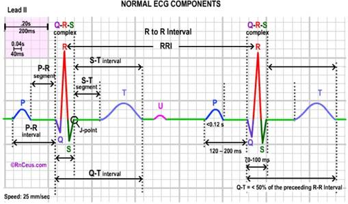

_Figure 14 Normal ECG_

or how long the ventricles remain depolarized before repolarizing (ǪT interval), etc.

An example of a **normal ECG** tracing is shown in _Figure 14 \[Fig 14\]_, which would display the regular P-ǪRS-T sequence for a healthy heartbeat. In contrast, _Figure 15 \[Fig 15\]_ illustrates an **abnormal ECG**, such as one might

_Figure 15 Abnormal ECG_

see in a cardiac arrhythmia or another pathology.

Deviations in the waveform can signal various issues. For instance, an ST segment elevation (a raise between the ǪRS complex and T wave) is a classic

sign of an acute myocardial infarction (heart attack). Extra P waves or missing ǪRS complexes might indicate heart block (an issue in conduction through the AV node). Very rapid, irregular oscillations instead of clear P waves could indicate atrial fibrillation, etc. Clinicians are trained to recognize these patterns. When interpreted properly, the ECG can detect a wide range of heart conditions – from arrhythmias and conduction blocks to electrolyte imbalances and effects of medications.

Table of different cardiac issues detected by eceg

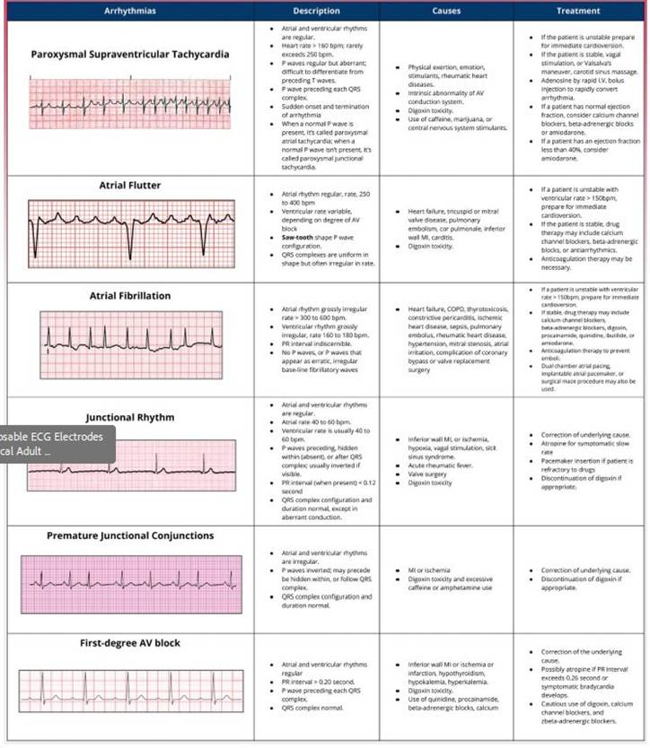

**Uses and Limitations of ECG:** The ECG is a fundamental tool in both clinical and research settings for monitoring heart health. It is noninvasive and inexpensive, making it ideal for initial evaluations (e.g. in emergency rooms or routine checkups). Continuous ECG monitoring is standard in many hospital settings for patients with cardiac risk. However, it’s important to recognize its limitations. The ECG provides an indirect picture of the heart’s electrical activity and can sometimes miss or misidentify conditions. For example, criteria for detecting **left ventricular hypertrophy (LVH)** (thickening of the heart’s left ventricle) on ECG have **high**

**specificity but low sensitivity** – meaning if the ECG shows LVH (high voltage QRS signals), it’s usually truly present, but many patients with LVH may still have a “normal” ECG and go undetected. In athletes, for instance, the heart can be enlarged or have electrical patterns that are normal for a trained athlete but might mimic disease; conversely, some subtle diseases might not produce obvious ECG changes. Furthermore, ECG interpretation can be subject to human error and inter-observer variability. Even computerized ECG interpretation is not foolproof – automated algorithms sometimes misread waveforms, so a trained professional must review the results for accurate diagnosis. Factors like poor electrode placement or contact, patient movement, or electrical noise can also affect ECG quality. Despite these challenges, the ECG remains an invaluable diagnostic tool. It is often used in conjunction with other tests (imaging like echocardiograms, blood tests, etc.) for a complete cardiac assessment.

In summary, an ECG works by **blending physics and biology**: it uses the physics of electrodes and circuits to measure voltages, and it relies on the biochemistry and physiology of the heart’s ion channels and conduction system to generate those voltages. By understanding both the _physics_ (how a voltage is created and measured) and the _physiology_ (how the heart’s cells produce electrical signals), engineers can design better ECG sensors and filters. An engineering student developing an ECG sensor must consider the small signal amplitudes (mV range), the need for amplification and noise filtering (for example, using instrumentation amplifiers with high common-mode rejection ratio to suppress 50/60 Hz noise), and the placement of electrodes (to capture meaningful signals corresponding to the heart’s activity). With this background, we see that the ECG is a beautiful integration of science: the electrical impulses born at the cellular level (via ion diffusion and membrane potential changes) become measurable voltages on the skin, which technology can capture and interpret to reveal the heart’s condition.

# Sources:

1.  University of Arizona medical school ( CMM410 lectures and BSM )
2.  OpenStax University Physics – Definition of electric potential difference
3.  TMSi Bio-signal Measurement Basics – Electrode function and bioelectric signal magnitudes
4.  Christ University Lecture Notes – Origin of bio-potentials and action potentials in cells
5.  University of Minnesota – Role of intercalated discs and gap junctions in cardiac impulse propagation
6.  Johns Hopkins Medicine – Heart’s electrical conduction system (SA node, AV node, His bundle, Purkinje)
7.  University of Minnesota – Timing of cardiac activation and relation to ECG (QRS and T wave)
8.  ResearchGate (Engin Eşme et al.) – Measurement of bio-potentials with electrodes; heart as a voltage source
9.  Goldberger’s Clinical Electrocardiography – ECG records the changing potential differences of the heart’s electrical field
10. Christ University Lecture Notes – 12-lead ECG perspectives and lead configurations
11. ECG Waves Journal – Limitations of ECG in diagnosing left ventricular hypertrophy (specificity vs sensitivity)
12. Christ University Lecture Notes – Clinical uses of ECG and limitations